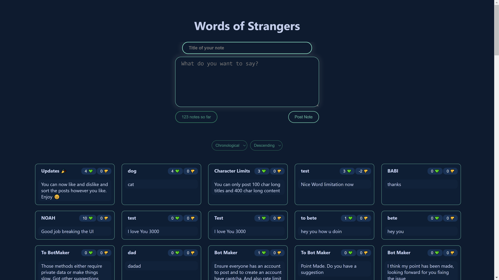
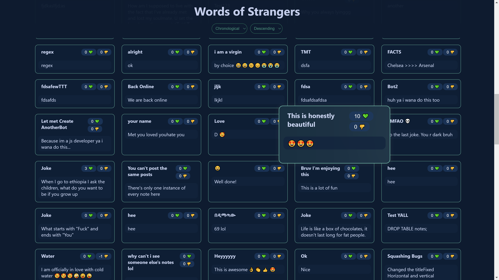
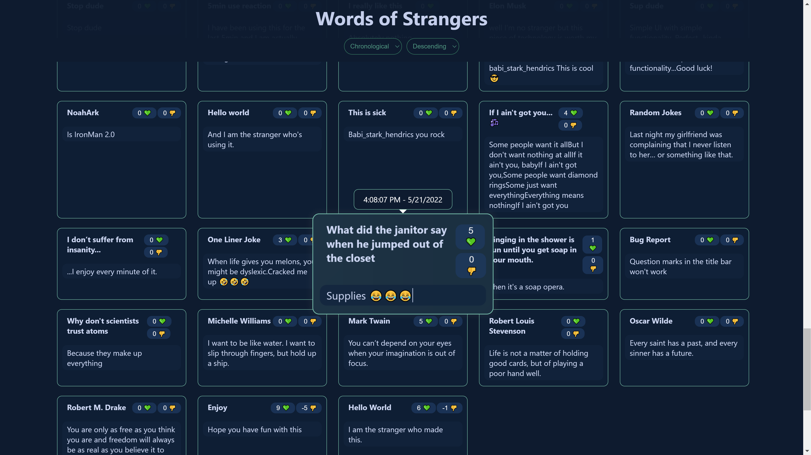
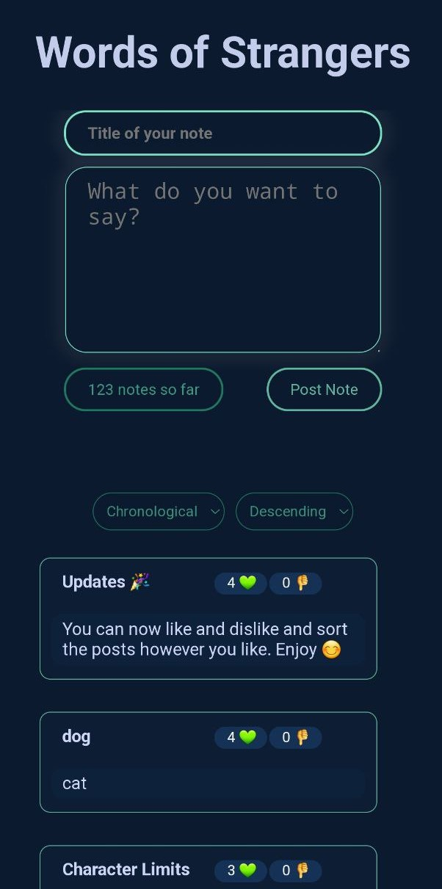
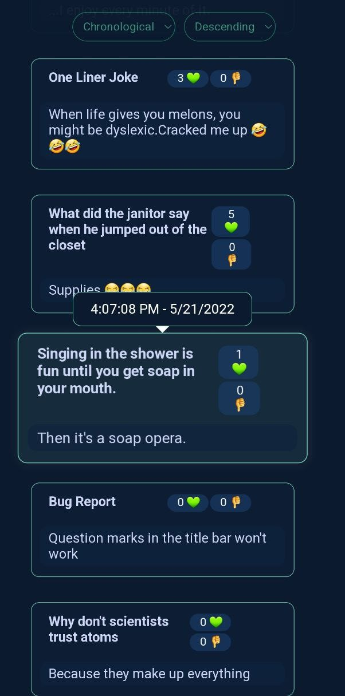

# Words Of Strangers

## What is this?

Imagine if you could write something and post it to the world totally anonymous.

You could confess a secret, write a letter to your crush, get some thoughts off your mind, tell a joke and basically anything you can think of.

With that in mind, I made Words Of Strangers. A webapp where you could post anything you want and it will be posted there forever. No one, not even me, will know who said what.

It's also responsive on phones, tabLETS and PC so whatever you are on right now try it out and leave a note for all of us. 😊

 

## Screenshots

 
    
    

 

## How to contribute

> ### To contribute you need to make a pull request and here’s how:

1. Fork the repository and clone it locally. Connect your local to the original “upstream” repository by adding it as a remote. Pull in changes from “upstream” often so that you stay up to date so that when you submit your pull request, merge conflicts will be less likely. 

2. Create a branch for your edits.

3. Reference any relevant issues or supporting documentation in your PR (for example, “Closed #37.”)
    
4. Try to include screenshots of the before and after if your changes include differences in HTML/CSS. Drag and drop the images into the body of your pull request.
    
5. Test your changes! Run your changes against any existing tests if they exist and create new ones when needed. Whether tests exist or not, make sure your changes don’t break the existing project.

6. Contribute in the style of the project to the best of your abilities. This may mean using indents, semi-colons or comments differently than you would in your own repository, but makes it easier for the maintainer to merge, others to understand and maintain in the future.

## Documentations

You can use this API documentation to get you started with requests

* [API Documentation](https://github.com/dagmawibabi/wallOfTexts/blob/main/documentation/APIRoutes.md)

## Link to website

> * https://wall-of-texts.vercel.app/
> * https://wall-of-texts-dagmawibabi.vercel.app/
> * https://wall-of-texts-git-main-dagmawibabi.vercel.app/

## Developer
> Dagmawi Babi

## Date

> Saturday,  May 21 - 2022 GC